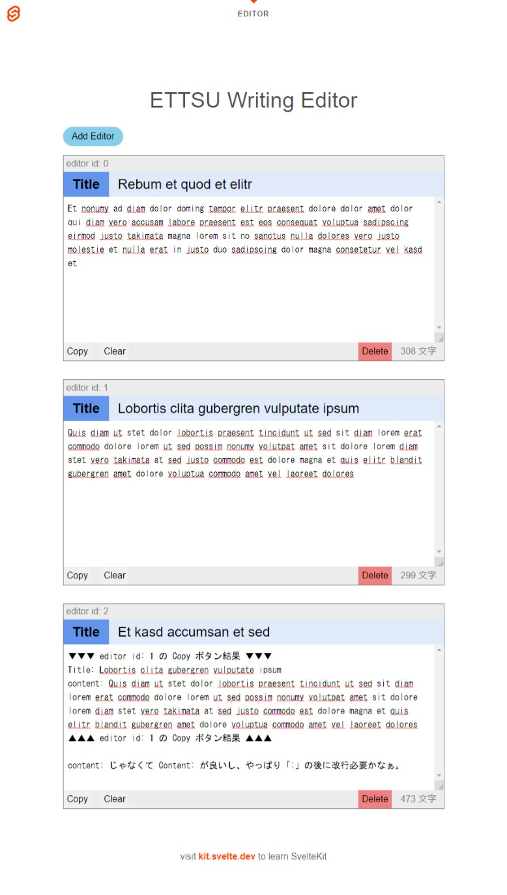

# ettsu-writing-editor

文章書くときにテーマ別に書きたいけど、1 つの場所で書きたい時の web テキストエディタ。

- テーマの数の分だけ Add Editor ボタンをクリックでエディタ増加。
- エディタにある Delete ボタンをクリックでエディタ削除
- それぞれのエディタが文字数カウントを備える
- 既存記法に対応したい
  - Markdown
  - Asciidoctor
- 出力機能を付けたい
  - エディタごとに出力要否を設定
  - 出力が必要なエディタごとにファイルにする
  - ファイルは zip に入れて DL させる

## 進捗

テンプレートに追記した程度で作成したまで。

## 稼働

とりあえずの。

```bash
npm run preview -- --open
```

## サンプル画像


